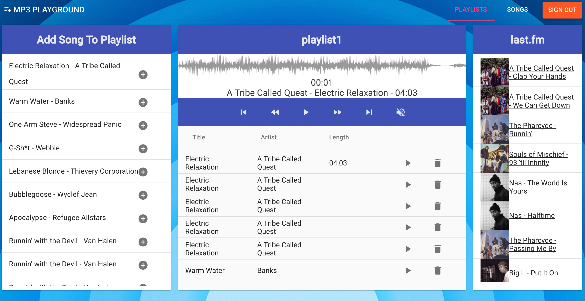

#MP3 Playground
##Enjoy and share your favorite music!

###This app is inspired by the classic media player 'Winamp', which is a simple yet powerfully efficient means to intereact with a collection of music files.  

###MP3 Playground allows you to upload music files to custom playlists from your computer and play them in the browser.

##Approach
This project was a great opportunity to gain experience working with the MEAN stack.  I enjoyed working with Amazon Web Services and found their interface for working with S3 (Simple Storage Service) to host music files to be straightforward and intuitive.  The npm module 'musicmetadata' made working with music files much easier, as it automatically parsed the file information for song title, artist, and duration.  

##Technologies Used

###
###MEAN Stack
* <a href="http://docs.mongodb.org/manual/">MongoDB</a>
* <a href="http://expressjs.com/">Express</a>
* <a href="https://docs.angularjs.org/guide">Angular</a>
* <a href="http://nodejs.org/api/">Node</a> | <a href="https://www.npmjs.com/">npm</a>
* <a href="https://aws.amazon.com/s3">Amazon S3</a> - File hosting
* <a href="http://wavesurfer-js.org">Wavesurfer.js</a> - Audio waveform vizualization
* <a href="https://jwt.io/">JSON Web Tokens</a> - User authentication
* <a href="https://material.angularjs.org/latest/">Angular Material</a> - UI Design Framework

##Project Planning
###[Trello Board / Wireframes / ERD](https://trello.com/b/qyHHHWQn/mp3-playground)

###API: [http://mp3playground-api.herokuapp.com/](http://mp3playground-api.herokuapp.com/)

##Unsolved Problems
* Confusing naming conventions.
* Enhanced features: Chat, visualizer.

##Installation Instructions
###Back-End

1. Go to https://github.com/AaronGoldsmith1/mp3playgroundserver.
2. Download repo.
3. In Terminal, navigate to project and type 'npm install'.
4. Run mongod and nodemon in seperate terminal windows.

###Front-End

1.  Go to https://github.com/AaronGoldsmith1/mp3playgroundclient.
2.	Download repo.
3. In Terminal, navigate to project and run http-server.
4. Change router endpoints to https://localhost:3000
5. Navigate to https://localhost:8000 in browser.
