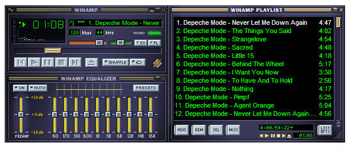

#MP3 Playground
##Enjoy and share your favorite music!

###This app is inspired by the classic media player 'Winamp', which is a simple yet powerfully efficient means to intereact with a collection of music files.  

###MP3 Playground allows you to upload music files to custom playlists from your computer and play them in the browser.

##Approach
I would like this project to be an opportunity to gain experience with the MEAN stack, and learn to work with hosting files while using MongoDB.  I enjoyed working with Amazon Web Services and found their interface for working with S3 (Simple Storage Service) to be straightfoward and intuitive.

User authorization proved to be problematic during the development process when bringing in AngularJS, and took up most my time.  However, I'm now in a position to start adding a pleasing GUI and plan to user Material or Semantic-UI.

##Technologies Used

###
###MEAN Stack
* <a href="http://docs.mongodb.org/manual/">MongoDB</a>
* <a href="http://expressjs.com/">Express</a>
* <a href="https://docs.angularjs.org/guide">Angular</a> 
* <a href="http://nodejs.org/api/">Node</a> | <a href="https://www.npmjs.com/">npm</a> 
* <a href="https://aws.amazon.com/s3">Amazon S3</a> - file hosting
* <a href="http://wavesurfer-js.org">Wavesurfer.js</a> - audio waveform vizualization

##Project Planning
###[Trello Board / Wireframes / ERD](https://trello.com/b/qyHHHWQn/mp3-playground)

###API: [http://mp3playground-api.herokuapp.com/](http://mp3playground-api.herokuapp.com/)

##Unsolved Problems
* Confusing naming conventions.
* Parsing music file metadata.
* Rendering playlist and media player controlls.
* Basic site routing / UI.
* Login Redirect.
* No styling.
* Enhanced features: Chat, visualizer.

##Installation Instructions
###Back-End

1. Go to https://github.com/AaronGoldsmith1/mp3playgroundserver. 
2. Download repo. 
3. In Terminal, navigate to project and type 'npm install'. 
4. Run mongod and nodemon in seperate terminal windows. 

###Front-End

1.  Go to https://github.com/AaronGoldsmith1/mp3playgroundclient. 
2.	Download repo. 
3. In Terminal, navigate to project and run http-server. 
4. Change router endpoints to https://localhost:3000 
5. Navigate to https://localhost:8000 in browser.
